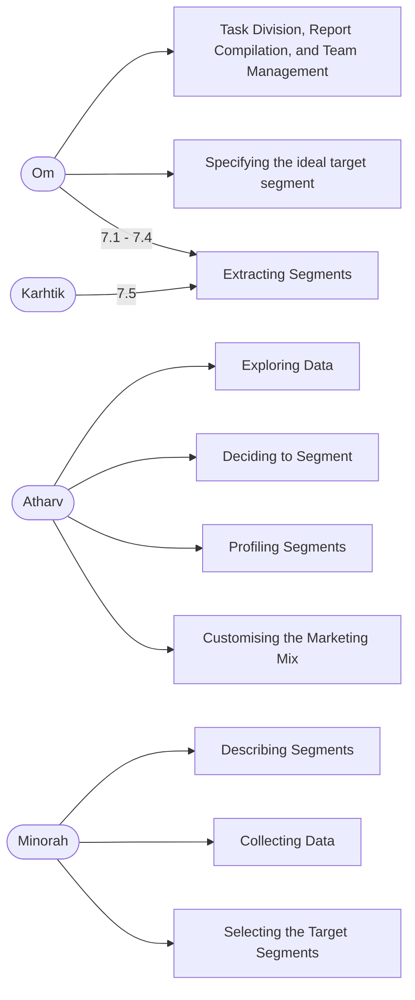

## Team members and info
|Name|GitHub repo link|
|--|--|
|Om Kapoor   | 
|Atharv Ojha | 
|Minorah Palli | 
|Karthik Kumar | 

## Study

>  
> 

### Market Segmentation steps

1. Deciding (not) to Segment
2. Specifying the Ideal Target Segment
3. Collecting Data
4. Exploring Data
5. Extracting Segments
6. Profiling Segments
7. Describing Segments
8. Selecting (the) Target Segment(s)
9. Customising the Marketing Mix

### Workload Assigned

## Team members info
- Om Kapoor
    - 8383075390
    - omkapoorok8@gmail.com | [LinkedIn](https://www.linkedin.com/in/om-kapoor-a06345197/)
- Atharv Ojha
    - 7033400306
    - atharvoza@gmail.com | [LinkedIn](https://www.linkedin.com/in/atharvojha/)
- Minorah Palli 
    - 7396337316
    - minorah777@gmail.com			
- Karthik Kumar
    - 8328005352
    - karthiknarsipatnam@gmail.com | [LinkedIn](https://www.linkedin.com/in/karthik-kumar-a2a211205/)
